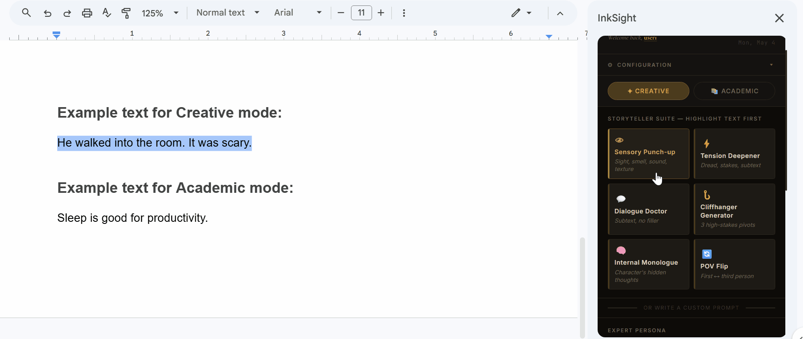

# InkSight
InkSight is a free, high-performance AI writing collaborator built directly into Google Docs, designed to transform flat drafts into professional-grade prose, using the Gemini 2.5 Flash engine.🚀

# 📖 InkSight AI: Professional Writing Engine
### A Dual-Mode AI Sidebar for Google Docs powered by Gemini 2.5 Flash.



## ✨ Overview
InkSight is a high-performance writing assistant built directly into the Google Docs ecosystem. Unlike standard AI wrappers, InkSight utilizes a **Selection-First Logic**—meaning it functions as an intelligent editor that requires human input, rather than a ghostwriter that generates text from scratch.

### 🛡️ The "Selection-Only" Guardrail
To ensure academic integrity and creative ownership, InkSight is hard-coded to ignore empty documents. If no text is highlighted, the UI triggers a "No Selection" alert. This architecture forces the user to remain the primary author, using AI only for refinement and critique.

---

## 🏗️ Technical Architecture: The Dual-Mode System
The sidebar is divided into two distinct logical modes to prevent UI bloat while maximizing utility.

### **✍️ Creative Mode (The Storyteller Suite)**
Designed for fiction and narrative prose. It focuses on sensory immersion and pacing.
*   **Sensory Punch-up**: Leverages Gemini's high-context window to inject visceral sight, sound, and smell into selected scenes.
*   **Internal Monologue**: [NEW] Analyzes action beats to generate character-specific subtext.
*   **POV Flip**: A regex-supported transformation between First and Third person perspectives.

### **🎓 Academic Mode (The Scholar Suite)**
Designed for students and researchers. It focuses on logic and structural clarity.
*   **Counter-Argument Generator**: [NEW] Analyzes a selected thesis and provides evidence-based opposing views to strengthen critical thinking.
*   **Academic Formalizer**: Rewrites casual drafting into a professional, peer-reviewed tone.
*   **Critical Reviewer**: Provides formative feedback (3 bullet points) instead of a direct rewrite.

---

## 🛠️ The Developer Dashboard
InkSight 2.0 introduces a real-time status monitor for a "Pro-App" feel:
- **Live Status Dot**: A pulsing green/red indicator that pings the script on load to verify API connectivity.
- **Personalization**: Uses `Session.getActiveUser()` to greet the author by name.
- **Focus Clock**: A built-in digital clock to keep writers grounded during long sessions.

---

## 🚀 Deployment Guide
1. **Clone the Template**: [Insert Link]
2. **API Integration**: Obtain a key from [Google AI Studio](https://aistudio.google.com/app/apikey).
3. **Deployment**: `Extensions > Apps Script > Deploy > New Deployment > Add-on`.
4. **Auth**: Authorize the script (DocumentApp, UrlFetchApp, and PropertiesService).

---

## 💥 Advanced Technical Post-Processing
To ensure AI output matches a professional manuscript format, InkSight runs a **Regex Chain** on every response to strip Markdown clutter:
```javascript
// Example of the post-processing logic used in Sidebar.html
const cleanText = aiResponse
  .replace(/\*\*/g, '')  // Removes Bold
  .replace(/\*/g, '')    // Removes Italics
  .replace(/#/g, '')     // Removes Headings
  .replace(/>/g, '');    // Removes Blockquotes
```
## ⚡ Performance & API Limits
- **The "High Demand" Bug**: Occasionally, Google's servers experience spikes in traffic. If you see a "High Demand" message, simply wait 30 seconds and try again.
- **Pro-tip (Stable Connection)**: For the most reliable experience, I recommend using your own Google AI Studio API Key in the settings. This bypasses the shared public quota and ensures your writing flow remains uninterrupted.
---

## 🔐 Privacy & Security

- 🔑 **Local Storage**: API keys are stored in **`UserProperties`** — they are encrypted and tied exclusively to your Google account.
- 📊 **Analytics**: Real-time usage (timestamps and actions) is logged to a private Google Sheet via **`SpreadsheetApp`**.
- 🚫 **Data Flow**: Selected text is sent via **`HTTPS`** to the Gemini API and is never stored on external servers.
- 💸 **Cost**: InkSight runs entirely on Google's free tier. No subscriptions, no payments, no hidden costs.

---

## 🧰 Tech Stack
- **Runtime**: Google Apps Script (V8 Engine)
- **AI**: Gemini 2.5 Flash (`v1beta` API)
- **Frontend**: HTML5, Tailwind CSS, Vanilla JavaScript
- **Fonts**: Cormorant Garamond (Literary), Inter (Functional)

---

## 📜 License & Attribution

© 2026 **Velora Labs / Ronel Jonathan**. All Rights Reserved.

This project is **source-available but not open-source**. You may:
- ✅ Use it for personal writing projects
- ✅ Fork it for private, non-commercial use
- ✅ Suggest improvements via Issues

You may **not**:
- ❌ Redistribute it under a different name
- ❌ Sell it, rebrand it, or use it commercially
- ❌ Remove author attribution from the source code

---

*Built with way too much Diet Coke and a deep obsession for optimizing productivity.*
